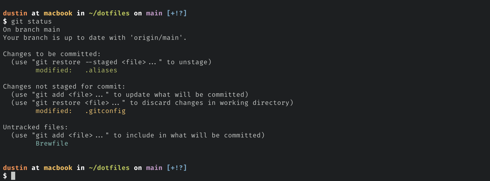

# Dustin’s dotfiles



My Bash, Git, Vim, and macOS settings. They started as a fork of [Mathias Bynens’s dotfiles](https://github.com/mathiasbynens/dotfiles).

**Warning:** These settings are mine. If you want to try them, fork the repository and review the code first, and remove what you don’t want.

## Set up a new Mac

1. Install [Homebrew](https://brew.sh/).

1. Clone the repository. The Git settings expect personal repositories under `~/projects/personal/`:

    ```bash
    git clone https://github.com/dmcass/dotfiles.git ~/projects/personal/dotfiles
    cd ~/projects/personal/dotfiles
    ```

1. Install the Homebrew packages:

    ```bash
    brew bundle --file=Brewfile
    ```

1. Make the Homebrew version of Bash your login shell:

    ```bash
    grep -qx "$(brew --prefix)/bin/bash" /etc/shells || echo "$(brew --prefix)/bin/bash" | sudo tee -a /etc/shells
    chsh -s "$(brew --prefix)/bin/bash"
    ```

1. Link the dotfiles into your home folder. To see what changes first, add `--dry-run`:

    ```bash
    ./bootstrap.sh
    ```

    The script links each tracked file into `~`. A file that is in the way moves to `~/.dotfiles-backup/`. The script doesn’t link `.macos`, the Brewfiles, `init/`, or this README.

1. Create the local files that hold settings for this Mac only. See [Local settings](#local-settings).

1. Optional: Apply the macOS defaults. Quit iTerm2 first, and run the script from Terminal. To also set the computer name, pass it as an argument:

    ```bash
    ./.macos COMPUTER_NAME
    ```

    Replace `COMPUTER_NAME` with the name for this Mac. Without an argument, the name doesn’t change.

## Update

Because `~` links to the repository, `git pull` updates your settings. After a pull adds a file, run `./bootstrap.sh` again to link it.

## Local settings

These files aren’t in the repository. Each one is optional.

### `~/.path`

Sourced first. Use it to extend `$PATH`.

```bash
export PATH="$HOME/Library/Android/sdk/platform-tools:$PATH"
```

### `~/.extra`

Sourced after the other shell files. Use it for aliases, functions, and exports that belong to one Mac or one employer. Don’t put secrets in it: load them when a command needs them, for example with `op read`.

```bash
alias work="cd ~/projects/work"
export EDITOR="code --wait"
```

### `~/.gitconfig.local`

Included at the end of `.gitconfig`. Put your Git identity, signing key, and work URL shorthands here.

```ini
[user]
    name = YOUR_NAME
    email = YOUR_EMAIL
    signingkey = GPG_KEY_ID

[includeIf "gitdir:~/projects/personal/"]
    path = ~/projects/personal/.gitconfig
```

Replace `YOUR_NAME`, `YOUR_EMAIL`, and `GPG_KEY_ID` with your own values. The `includeIf` section loads a second identity for repositories under `~/projects/personal/`.

## iTerm2 settings

`init/iterm2.plist` holds the iTerm2 settings: profiles, color presets, and the hotkey window. It leaves out window positions and other state.

- To save a change you made in iTerm2, run `init/iterm2-export.sh`, and commit `init/iterm2.plist`.
- To load the settings, quit iTerm2 and run `init/iterm2-import.sh` from another terminal. `.macos` runs it for you.

VS Code uses Settings Sync. `init/vscode-settings.json` is a copy of its settings for reference.

## Thanks

Based on [Mathias Bynens’s dotfiles](https://github.com/mathiasbynens/dotfiles) and the people he credits there.
